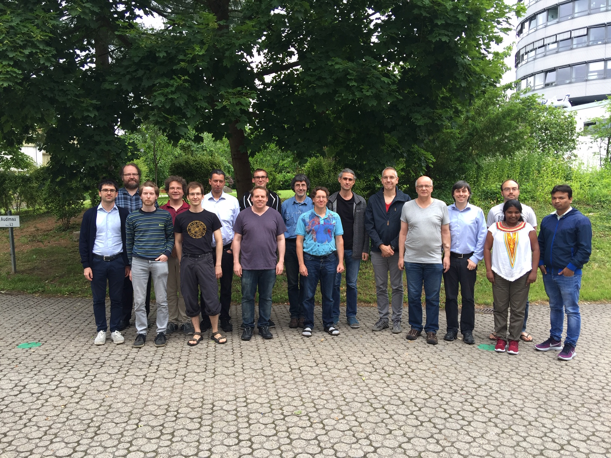

# OSCAR developer meeting

## June 11 - June 14 ,  TU Kaiserslautern

## Information

For more information, see

<ul>

    
        <li>
            <a href="{{ node_inner.url | relative_url }}">{{node_inner.title}}</a>
        </li>
    

</ul>

## Contact

If you have questions or suggestions, please contact the organizers:

* [Sebastian Gutsche](mailto:gutsche@mathematik.uni-siegen.de)
* [William Hart](mailto:wbhart@mathematik.uni-kl.de)

## Sponsors

This workshop is supported by [SFB-TRR 195](https://www.computeralgebra.de/sfb/) -- Symbolic Tools in Mathematics and their Application.

## Other meetings

Please visit [the meetings page]({{ site.baseurl }}/meetings) for an overview of the OSCAR meetings.
