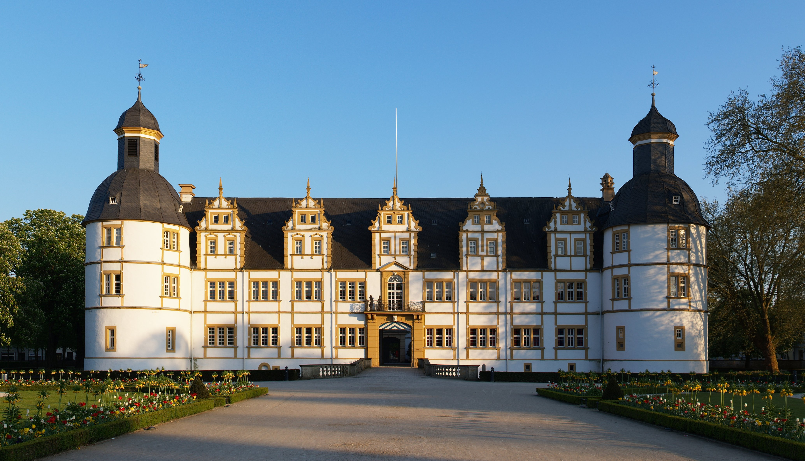

# SFB-TRR 195+358: Coactive, collaborative, coprime.

## September 20 - 21, Paderborn University

{:class="img-responsive"}

## Information

Goal of the meeting is to strengthen existing and explore new collaborations between the [SFB-TRR 195](https://www.computeralgebra.de/sfb/) and [SFB-TRR 358](https://trr358.math.uni-bielefeld.de/).  For more information, see

<ul>

    
        <li>
            <a href="{{ node_inner.url | relative_url }}">{{node_inner.title}}</a>
        </li>
    

</ul>

## Contact

If you have questions or suggestions, please contact the organizers:
* [Claus Fieker](mailto:fieker@mathematik.uni-kl.de)
* [Jürgen Klüners](mailto:klueners@math.uni-paderborn.de)
* [Yue Ren](mailto:yue.ren2@durham.ac.uk)

## Sponsors

This workshop is supported by
* [SFB-TRR 195](https://www.computeralgebra.de/sfb/) -- Symbolic Tools in Mathematics and their Application
* [SFB-TRR 358](https://trr358.math.uni-bielefeld.de/) -- Integral Structures in Geometry and Representation Theory
