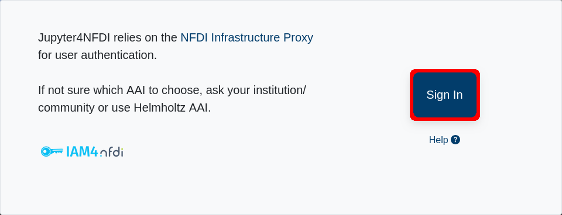
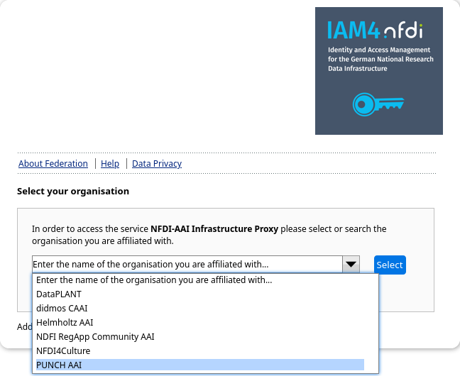
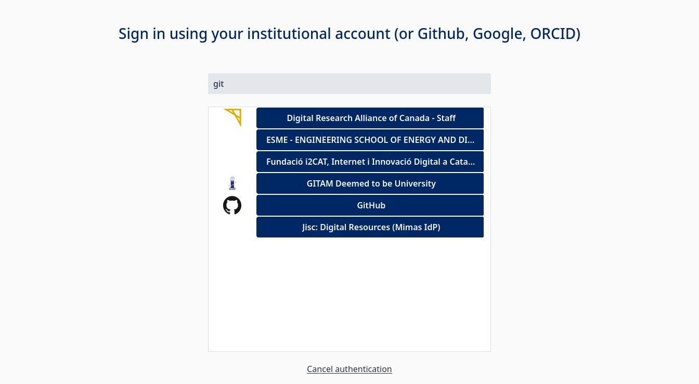
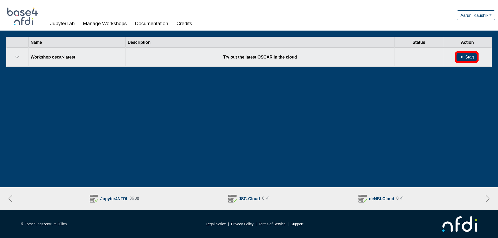
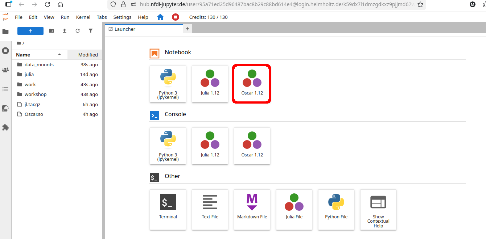
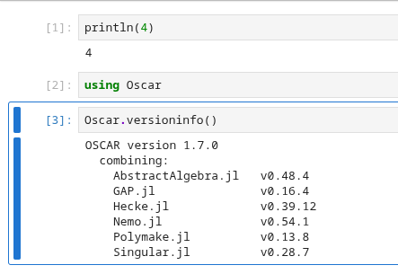

# Try OSCAR Online

OSCAR can be tried online without installation, on the NFDI jupyter hub.

The NFDI Jupyter hub allows 130 credits worth of usage per user per day. Trying out OSCAR requires
40 credits per hour. So, OSCAR can be tried out online free of cost for slightly more than 3 hours
in a day.

Use the following steps:

1. Go to
   <https://hub.nfdi-jupyter.de/workshops/oscar-latest>,
   and login. Select "Helmholtz AAI" if no other choice applies to you.
   {: width="50%" }
   {: width="50%" }

2. Select your academic institution, or Google/Github/ORCID to identify yourself. Follow the
   authentication workflow of your chosen service (different for each service). It should be safe to
   allow permissions asked for along this workflow.

   If this is the first time you are logging in to Helmholtz AAI, there may be additional sign up
   screens. If at any point you get stuck, try starting over by visiting (not using the back button)
   <https://hub.nfdi-jupyter.de/workshops/oscar-latest>.
   As the Helmholtz specific setup needs to be done only once, this should not get you stuck into an
   infinite loop!
   {: width="50%" }

4. You should now see a list similar to the one depicted in the screenshow
   below, with a row saying "Try out the latest OSCAR in the cloud" and a
   "Start" button to the right of it. Click on that "Start" button to start
   OSCAR online. This may take some time, up to 10 minutes. You will be
   automatically redirected to a jupyter interface when it is ready
   {: width="50%" }

5. Select the option in the notebook section which says "Oscar".
   {: width="50%" }

6. Try to execute a simple statement to check that the Julia kernel has started and is connected to the
   notebook, `println(4)`, for example. (This may take multiple minutes as the server finishes
   setting up things in the background.)

7. You can now use OSCAR as per normal instructions. Maybe try out the [Linear Algebra
   Tutorial](https://nbviewer.org/github/oscar-system/OSCARBinder/blob/master/LinearAlgebraInOSCAR.ipynb).
   Note that running `using Oscar` is a required step, but will not print the OSCAR banner. Run
   `Oscar.versioninfo()` to verify the version of OSCAR being used.

{: width="50%" }
