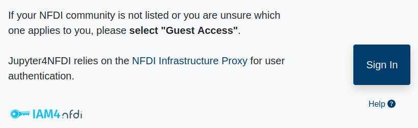
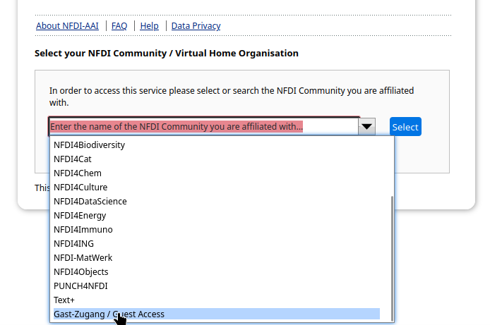
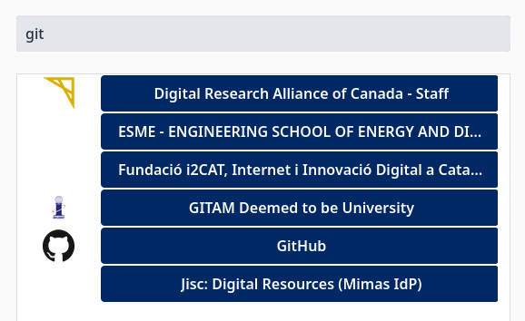
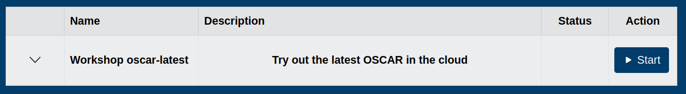
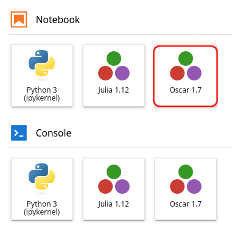
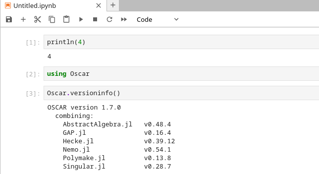
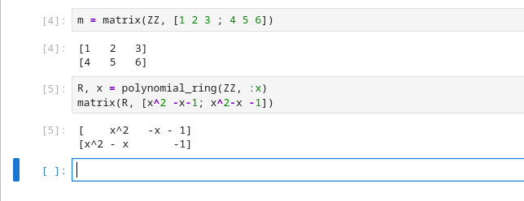

---

You can try OSCAR online without installing anything,
using the NFDI JupyterHub service.

The NFDI JupyterHub provides free daily computing resources for
interactive sessions such as OSCAR. The available quota is subject
to change, but is typically sufficient for exploring OSCAR and
running tutorials for a few hours.

Occasionally, the login process may stall or become unresponsive.
In that case, we recommend restarting the process by revisiting
<https://hub.nfdi-jupyter.de/workshops/oscar-latest>.

---

Follow the following steps to try out OSCAR online.

1. Visit <https://hub.nfdi-jupyter.de/workshops/oscar-latest> and click the "Sign In" button.

   {: style="display: block; margin-left: auto; margin-right: auto;" width="80%" }

2. On the next page, select "Gast Zugang / Guest Access" if no other option applies to you.

   {: style="display: block; margin-left: auto; margin-right: auto;" width="80%" }

3. Select your academic institution, Google, GitHub, or ORCID to sign in,
   and follow the authentication workflow. On first login, additional
   registration steps may appear.

   {: style="display: block; margin-left: auto; margin-right: auto;" width="60%" }

4. You should now see a list containing an entry called
   "Try out the latest OSCAR in the cloud" with a "Start" button to its right.
   Click the "Start" button to launch OSCAR online.

   {: style="display: block; margin-left: auto; margin-right: auto;" width="100%" }

   Startup may take several minutes, after which you will be redirected to a Jupyter interface.

5. In the **Notebook** section, click the entry labeled "Oscar" to launch a Jupyter notebook.

   {: style="display: block; margin-left: auto; margin-right: auto;" width="35%" }

   Other launch options are available as well. If you accidentally launch a
   different entry, simply close the browser tab and return to the launcher page.

7. You can now use OSCAR inside the Jupyter notebook.

   First, run a simple statement such as `println(4)` to verify that the
   Julia kernel is connected to the notebook. This step may take several
   minutes while the server completes its setup.

   Next, run `using Oscar` to load OSCAR and
   `Oscar.versioninfo()` to display information about the loaded OSCAR version.

   {: style="display: block; margin-left: auto; margin-right: auto;" width="70%" }

8. You are now ready to run computations with OSCAR.

   {: style="display: block; margin-left: auto; margin-right: auto;" width="70%" }

   Fancy one of our [tutorials]({{site.baseurl }}/tutorials/)?
